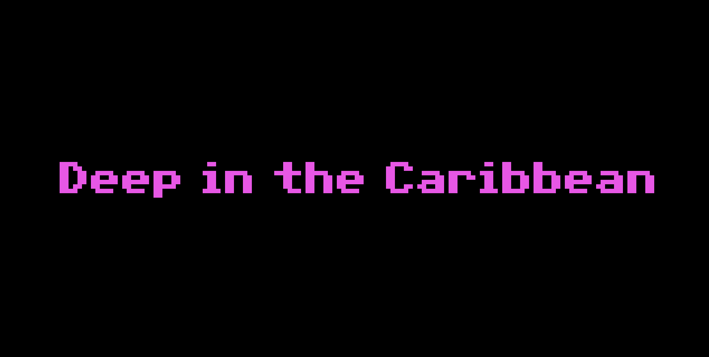

# 🏝️ Swordy ⚔️ Island 🏝️

<div align="center">
  
</div>
<div align="left">
   <i>My name is Guyblock Threecube, and I want to be a pirate!</i>
</div>
<br clear="left">


Welcome to Swordy Island. This is a 3D interactive scene built with **Three.js**.

This fan game is a homage to the legendary **The Secret of Monkey Island**, featuring a 3D recreation of *Mêlée Island*, where you can explore, interact, and engage in insult sword fighting! 🏴‍☠️

🧌 Disclaimer: **This game is a work in progress!** The *master* branch is used for releases on GitHub Pages, while the *developer* branch contains the latest updates.

<div align="center">
  
</div>

## Features 🗡️

- 3D environment with buildings, ocean, and land
- Pirates that move around the island (using A* algorithm inside a non-convex polygon 🤓)
- Dynamic lighting and shadows
- Point and click to move the main character, Guyblock

## Usage ⛵

- Try it [here](https://alvarofergar.github.io/swordy-island/)!
- Click on the island to move Guyblock to the clicked location.
- Use the OrbitControls to take a look at the island

## File Structure 📁

```
├── assets
│   ├── background.png
│   ├── guyblock.ico
│   ├── lucasarts-scumm-solid.otf
│   ├── Monplaisir - Soundtrack.mp3
│   ├── orbitControls.json
│   └── swordyisland.svg
├── characters
│   └── pirate.js
├── text
│   └── text.js
├── utils
│   ├── astarisborn.js
│   ├── box.js
│   ├── misc.js
│   └── polyutils.js
└── world
│   ├── buildings.js
│   ├── land.js
│   └── ocean.js
│
├── index.html
├── style.css
├── main.js
├── README.md

```

## Todos 🐒

- [ ] Add insult sword fighting mechanics with insults dictionary and camera movements
- [ ] Add Sword Master
- [ ] Add text to locations
- [ ] Add more sound effects and background music tracks
- [ ] Optimize performance


## Credits 📚

- **Ocean rendering** is heavily inspired by [prisoner849's work](https://jsfiddle.net/prisoner849/79z8jyLk/) from the [Three.js forum](https://discourse.threejs.org/t/low-poly-ocean-water/33513/7).

- **Background music**: [*Monplaisir*](https://www.youtube.com/watch?v=Ddrs6FXIJ-g&list=PLs0Tb3hSGtOfbBtAu3obXYHvwnxRXI8C8) from the [FreeMusic channel](https://www.youtube.com/channel/UC-t0mtx38daJoDMoiWrmIaw/about)
